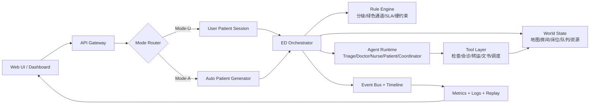

# 模拟医院急诊科 MAS 项目 Brainstorm（优化版，EDSim 主线）

> 版本说明：本版基于 `technical_reference.md` 与 `medical_background.md` 进行强化，目标是为下一步 planning 提供可直接落地的高质量输入。

---

## 1. 目标与范围收敛

## 1.1 项目目标（Week 4–12）
- 基于 EDSim 构建“急诊科多智能体仿真系统”，覆盖：分诊、分区分流、检查、治疗、会诊、留观、住院/出院/转院。
- 同时支持两种模式：
  - `Mode-U`（User-in-the-loop）：用户扮演患者，通过 LLM 对话输入主诉，参与诊疗流程。
  - `Mode-A`（Autonomous MAS）：患者与医护 agent 全自主协作，用于系统仿真与 what-if 实验。
- 课程导向：工程可交付优先，确保每周有可演示增量。

## 1.2 系统边界
- 这是**流程与运营仿真系统**，不是临床执业系统。
- LLM 不承担最终医疗裁决；高风险环节由规则引擎硬约束。
- 允许 LLM 负责：多轮对话、信息整合、交接摘要、任务排序建议、解释性输出。

---

## 2. 医疗规范约束（必须体现在系统设计中）

## 2.1 急诊对象与绿色通道
- 急危重症、严重创伤、慢病急性发作、突发公共事件、三无危重患者均应进入急诊路径。
- 绿色通道遵循“先救治后手续”原则。

## 2.2 分级与分区（工程映射）
- `Level 1`（濒危）/`Level 2`（危重） -> 红区。
- `Level 3`（急症） -> 黄区（候诊时间控制，病情可升级）。
- `Level 4`（非急症） -> 绿区（快诊/快速处置）。
- 若生命体征异常，分级上调一级。

## 2.3 时间与流程硬约束
- 红区患者应抢占式处理中断低优先任务。
- 留观/抢救时长应有上限约束（规范上常见 72h 边界）。
- 检查、会诊、转运存在 SLA（可配置时限）。

---

## 3. 方案对比与最终选型

## 3.1 方案对比
- A（选定）：EDSim-first 双模式扩展。
- B：MedAgentSim-first + 运营层补齐。
- C：全新重构。

## 3.2 选型理由
- A 能最快达成“课程节奏 + 可运行演示 + 指标可观测”三目标。
- EDSim 天然具备地图、队列、流程状态、角色协作基础，适合作为工程主干。

---

## 4. 目标系统架构（Brainstorm 结构）

## 4.1 关键分层
- `Rule Layer`：医疗与流程硬约束（不可被 LLM 绕开）。
- `World Layer`：全局真实状态（床位、队列、报告、会诊、资源）。
- `Agent Layer`：角色协作循环（Observe -> Plan -> Act）。
- `Tool Layer`：结构化动作接口，避免“纯文本幻想执行”。
- `Observability Layer`：可回放、可解释、可打分。

---

## 5. 双模式统一状态机

## 5.1 Patient 状态机（建议）
`ARRIVAL -> TRIAGE -> ZONE_ROUTED -> WAIT_FOR_DOCTOR -> ASSESSMENT -> TEST_ORDERED -> WAIT_RESULT -> REASSESS -> DISPOSITION -> (DISCHARGED | OBSERVATION | ADMISSION | TRANSFER | LWBS)`

## 5.2 模式差异仅在入口
- Mode-U：`ARRIVAL` 与主诉由用户驱动。
- Mode-A：`ARRIVAL` 与主诉由生成器驱动。
- 后续流程复用同一状态机与同一规则层，保证可比性。

---

## 6. Agent 规格（Role / Initialization / Workflow）

## 6.1 MVP 核心 Agent（建议 6 类）
1. Patient Agent / User Patient
2. Triage Nurse Agent
3. ED Physician Agent
4. Bedside Nurse Agent
5. Specialist Consultant Agent
6. ED Flow Coordinator Agent

## 6.2 关键字段（跨 agent 统一）
- `agent_id`, `role`, `shift`, `zone_scope`, `authority`, `max_load`, `skills`, `status`。

## 6.3 每类 agent 最小职责
- `Patient`：提供信息、配合流程、触发等待行为（含 LWBS 可能）。
- `Triage`：分级分区、绿色通道触发。
- `Physician`：评估、下检查、复评、处置去向。
- `Bedside Nurse`：执行医嘱、转运、监测。
- `Consultant`：响应会诊并决定专科衔接。
- `Coordinator`：全局队列/床位/拥堵调度。

---

## 7. Planning / Memory / Tool Use（方法学收敛）

## 7.1 Planning 策略
- 双层计划：
  - 粗粒度（班次任务目标）
  - 细粒度（下一动作 top-k 候选）
- 优先级机制：危重中断 > 结果已回 > 等待超时 > 常规任务。

## 7.2 Memory 结构
- `Short-term`：当前 encounter 状态、最近对话、待办任务。
- `Episode`：本次就诊事件时间线（event log）。
- `Long-term(optional)`：成功案例与失败反思（后期可用于经验检索）。

## 7.3 Tool 接口最小集合
- `triage_assign(patient)`
- `route_zone(patient, zone)`
- `order_test(patient, test_type)`
- `post_result(order_id, result)`
- `request_consult(patient, dept)`
- `move_patient(patient, room)`
- `update_disposition(patient, target)`
- `write_note(encounter_id, content)`

---

## 8. 空间与资源建模（从 medical_background 强化）

## 8.1 空间对象
- 支持区：挂号/收费/急诊检验/影像/药房。
- 医疗区：分诊台、红/黄/绿区、抢救室、创伤室、留观室、EICU。

## 8.2 资源对象
- 人力：triage nurse、doctor、bedside nurse、consultant。
- 床位：red beds、yellow beds、green chairs、observation beds、EICU beds。
- 检查：CT/X-ray/超声/检验队列与周转时长。

## 8.3 资源竞争规则
- 红区资源抢占优先。
- 检查/会诊按临床优先级调度。
- 出现 boarding 时由 Coordinator 触发缓解策略。

---

## 9. 评测框架（工程导向）

## 9.1 运行稳定性
- 连续运行时长、崩溃率、恢复成功率、超时率。

## 9.2 流程质量
- 到达-分诊时长、分诊-首诊时长、检查周转时长、处置总时长。
- 按等级分层统计等待时间与完成率。

## 9.3 协作效率
- 队列峰值、床位利用率、会诊响应时长、任务冲突率。

## 9.4 安全合规
- 高风险输出拦截率。
- 免责声明与不确定性提示覆盖率。
- 敏感信息最小暴露率。

---

## 10. Week 4–12 路线（强化版里程碑）

| Week | 目标 | 关键交付物 | 可演示定义（DoD） |
|---|---|---|---|
| 4 | 需求与架构冻结 | PRD + 架构图 + 状态机 + 指标定义 | 可讲清双模式与规则层边界 |
| 5 | 核心后端打通 | RuleEngine + WorldState + EventBus + 工具接口 | CLI 可走通完整流程（不含复杂 UI） |
| 6 | Mode-U 可用 | 用户主诉入口 + 分诊问诊链路 + 地图基础视图 | 用户能扮演患者走完一次就诊 |
| 7 | Mode-A 可用 | 自动病人生成 + agent 自主协作调度 | 自动模式稳定运行并产出事件日志 |
| 8 | 中期集成评测 | 指标仪表盘 v1 + 中期报告 | 展示指标变化与瓶颈定位 |
| 9 | 安全与治理 | 风险拦截、免责声明、审计日志 | 高风险输出可被策略阻断 |
| 10 | 鲁棒性优化 | 超时重试、故障恢复、回放复现 | 长时运行（>30 分钟）稳定 |
| 11 | 实验与对比 | what-if 场景（床位/人力/检验延迟） | 输出图表与结论可复现实验 |
| 12 | 最终交付 | 终版系统 + 技术报告 + 演示视频 + 答辩稿 | 现场可演示双模式与指标闭环 |

---

## 11. 风险清单与应对

| 风险 | 影响 | 触发信号 | 缓解策略 |
|---|---|---|---|
| LLM 输出漂移 | 决策不稳定 | 同输入输出波动大 | 规则层硬约束 + 模板回退 |
| 仓库耦合改造困难 | 进度延误 | 单模块改动牵连广泛 | 先做适配层（anti-corruption layer） |
| 指标不可追踪 | 难答辩 | 日志不全/口径不一致 | 统一 event schema + 统计口径 |
| 计算成本超预算 | 测试无法持续 | API 调用激增 | 分层缓存 + 低成本批量仿真模式 |

---

## 12. Brainstorm 输出到 Planning 的接口

下一步 planning 文档可直接继承本 brainstorm，按以下结构展开：
- `background`
- `challenges`
- `innovation`
- `method`
- `result`
- `Week-by-week execution plan`

并将本文件中的：
- 双模式状态机
- agent 规格
- 指标体系
- 里程碑与 DoD
作为 planning 的主干输入。
