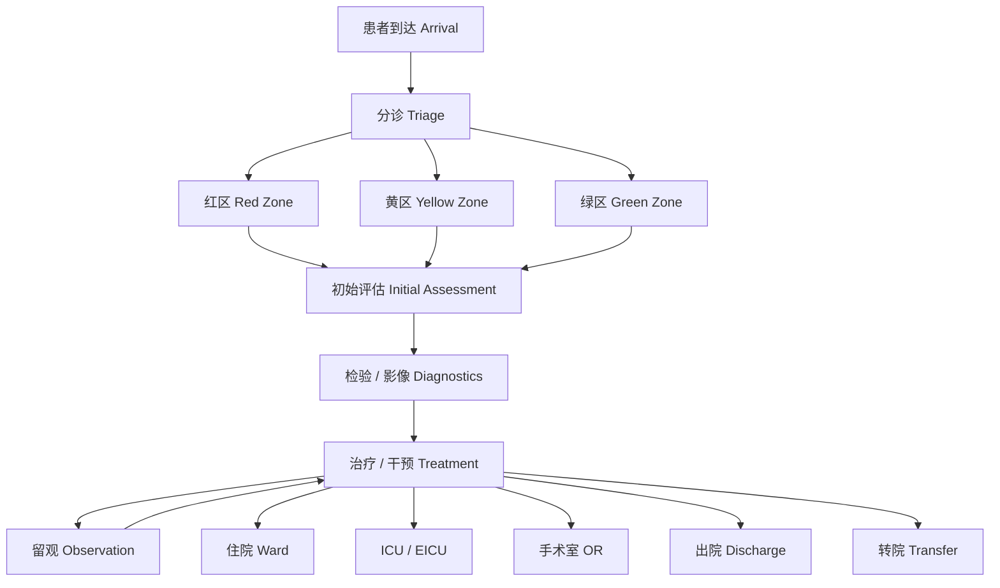
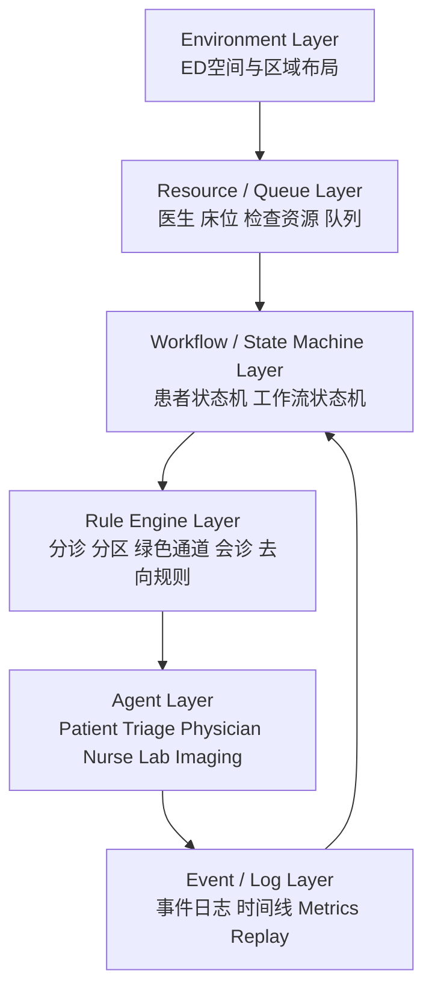
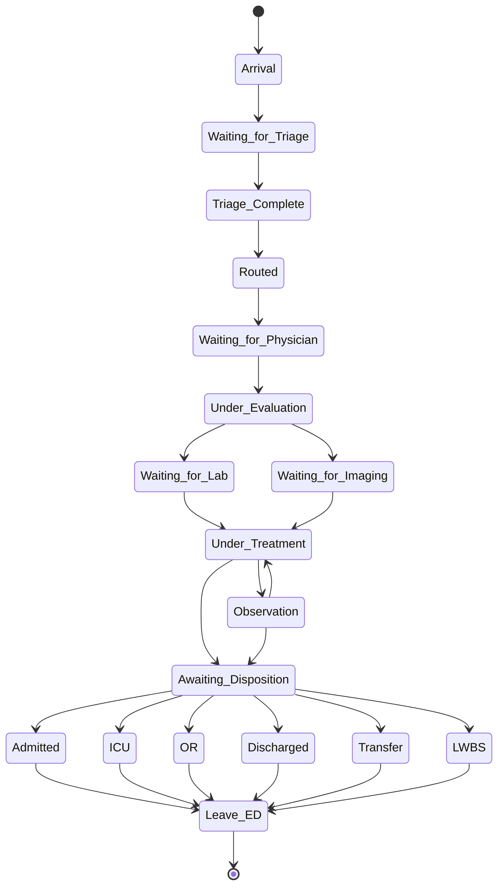

# 1. 项目定位与答辩主线

本项目是一个**急诊流程与资源约束下的多智能体仿真系统（ED-MAS）**。它面向医院急诊科这一高动态、高压力、强资源约束场景，模拟患者从到达到离开急诊的完整流转过程，并刻画分诊、排队、检查、治疗、留观、住院、转院等关键环节中的角色协作与系统瓶颈。

本项目**不是普通医疗问答系统**，也不是完整数字医院。它的 challenge 主线是：在急诊流程约束、优先级机制和有限资源条件下，构建一个既能反映系统级 bottleneck，又能体现多角色行为决策影响的可运行仿真平台。其价值在于把“急诊工作流理解”“多智能体系统设计”“工程可实现架构”三者打通。

---

# 2. 为什么这个项目值得做

急诊科的核心难题，往往不是单点诊断本身，而是**患者随机到达、分诊优先级差异、床位与医护资源不足、检查周转延迟、处置去向受限**等因素共同导致的系统性拥堵。真实急诊中，等待时间、LOS、PIA delay、boarding delay 和资源冲突，直接影响患者安全与医院运行效率。

这个问题非常适合作为课程项目，因为它天然具备多智能体角色、多阶段流程、可视化环境、可调资源参数和清晰的工程验证指标。相比泛化医疗对话系统，急诊仿真更能体现“问题定义明确、系统边界清晰、工程实现可落地、答辩演示可展示”的特点。

---

# 3. 急诊场景与完整工作流

急诊患者的主线流程可以概括为：**到达 -> 分诊 -> 分区 -> 初始评估 -> 检验/影像 -> 治疗/干预 -> 留观或最终去向**。这一流程既包含串行环节，也包含大量并行环节，尤其在红区抢救、绿色通道、专科会诊和急诊手术场景中更为明显。



## 3.1 患者到达与分诊

患者通过步入、120 转运或院前急救进入急诊。分诊护士基于主诉、生命体征、到院方式和病情严重程度完成初筛，形成分诊等级、优先级和分区结果。对于危及生命或符合绿色通道条件的患者，系统应立即升级，不进入普通等待逻辑。

## 3.2 红黄绿分区与初始评估

红区对应危重患者，黄区对应急症患者，绿区对应轻症或快速处理患者。分区之后，急诊医师和床旁护士开展初始评估，包括病史采集、体格检查、生命体征复测、监护、静脉通道建立和必要的急救干预。

## 3.3 检验、影像与治疗干预

在初始评估之后，系统进入诊断与治疗阶段。急诊医师可下达检验、影像、药物、输液、会诊或手术相关医嘱。对于危重患者，抢救、检查申请、会诊和转运可能并行发生。检验科、影像科、超声科和药学部门共同构成急诊中的关键服务节点。

## 3.4 留观与最终去向

患者在处置后可能进入留观、住院、ICU/EICU、手术室、转院或直接离院。留观患者需持续复评，病情恶化时应立即升级。最终去向不仅是临床决策结果，也是资源状态和床位容量共同作用后的系统结果。

---

# 4. 从 Stanford Town 到 ED-MAS 的映射

Stanford Town / Generative Agents 为本项目提供的不是业务流程模板，而是**agent 抽象、记忆结构、环境建模、事件循环和行动管线**的架构启发。它告诉我们：一个复杂系统中的角色，不只是函数调用节点，而是带有局部状态、局部记忆、局部决策能力的行为体。

| Stanford Town 概念 | ED-MAS 对应概念 | 迁移方式 |
|------|------|------|
| Persona | 临床 / 运营 Agent | 保留 agent 抽象，改为职责驱动角色 |
| Memory | 临床记忆 / 事件记忆 / 系统状态 | 从生活记忆改为病例、结果、任务与事件 |
| Scratch | 短期工作状态 | 直接复用为当前任务、当前空间、待办事项 |
| Perceive -> Retrieve -> Plan -> Reflect -> Act | 感知 -> 检索 -> 局部计划 -> 可选反思 -> 执行 | 只在部分 agent 上完整使用 |
| Environment | 急诊空间布局 | 从小镇地图改为 ED 功能区和资源空间 |
| Event loop | 仿真主循环 | 从日常活动推进改为急诊 workflow 推进 |

必须强调：**这不是 town-life simulation，而是 ED workflow simulation**。因此，Stanford Town 中的 daily routine、开放式社交 planning、长篇 narrative reflection 不能直接照搬。急诊系统必须增加临床工作流、分诊规则、资源队列、空间容量和去向决策等专属模块，并由显式状态机和规则引擎主导系统主线。

---

# 5. 系统总体架构

从系统视角看，ED-MAS 可以拆成六层：`Agent layer`、`Workflow / State Machine layer`、`Rule Engine layer`、`Resource / Queue layer`、`Environment layer`、`Event / Log layer`。其中，Workflow 和 Rule Engine 提供主控制逻辑，Agent 提供局部行为，Resource / Queue 体现系统瓶颈，Environment 提供空间约束，Event / Log 提供 replay 与 metrics 基础。



这一架构的关键原则是：**系统状态不交给 LLM 控制，资源调度不交给 narrative memory 控制，流程推进由状态机和规则引擎显式管理**。Agent 的作用是在规定边界内感知、决策和执行，而不是替代整个系统的 workflow 控制器。

---

# 6. 核心 Agent 设计

核心 agent 不需要都做成“高智能反思体”。更稳妥的做法是把 agent 分成两类：一类偏决策和交互，适合带有限 memory / planning；另一类偏规则执行和资源处理，更适合 rule-based 实现。

| Agent | 角色 | 输入 | 输出 | 工作流位置 | 推荐实现方式 |
|------|------|------|------|------|------|
| Patient Agent | 患者侧行为体，承载症状、等待、配合、离院倾向 | 主诉、症状、医嘱、等待时间 | 症状陈述、响应、LWBS 风险 | 全流程 | 可带有限 memory / narrative |
| Triage Nurse Agent | 初筛、分级、分区、绿色通道识别 | 主诉、生命体征、到院方式 | triage level、zone、green channel | 到达后第一步 | 规则优先 |
| Emergency Physician Agent | 初始评估、诊断、治疗、会诊、去向决策 | 分诊结果、病史、结果、护理反馈 | orders、plan、consult、disposition | 核心中枢 | agent + rule hybrid |
| Bedside Nurse Agent | 监护、给药、输液、转运、留观巡查 | 医嘱、vitals、任务队列 | 护理记录、执行状态、异常上报 | 评估后持续参与 | 规则执行为主 |
| Specialist Consult Agent | 专科会诊、专科处置建议 | 会诊请求、病情摘要、结果 | consult note、接收建议 | 复杂病例 / 升级场景 | 有限 planning |
| Imaging Agent | 影像排队、执行、结果回传 | imaging order、优先级、转运状态 | queue status、result、critical alert | 诊断阶段 | 规则 / 队列优先 |
| Lab Agent | 检验排队、处理、结果回传 | lab order、标本、优先级 | result、critical alert | 诊断阶段 | 规则 / 队列优先 |
| Bed / Resource Management Agent | 管理区域床位、候床、资源冲突 | triage result、occupancy、disposition request | placement、queue、conflict alert | 分区与去向阶段 | 纯确定性 |
| ICU / OR / Disposition 相关 Agent | 处理 ICU、OR、病房接收与最终去向 | 病例摘要、床位状态、手术请求 | acceptance、waitlist、transfer result | 终局路径 | 规则驱动为主 |

这些 agent 的共同点是都围绕 `Patient Case` 展开，但它们的认知复杂度不同。Patient、Physician、Specialist 更适合承担局部记忆与解释性行为；Triage、Lab、Imaging、Bed Management 更适合由规则和队列驱动。

---

# 7. 患者状态机与工作流状态机

急诊系统的主状态机应围绕患者旅程展开，并显式维护升级触发器。主状态机不是对话链，而是 workflow 的结构化表达。



## 7.1 主状态流转

主状态流转建议至少包含：

- Arrival
- Waiting for Triage
- Triage Complete
- Routed
- Waiting for Physician
- Under Evaluation
- Waiting for Lab / Imaging
- Under Treatment
- Observation
- Awaiting Disposition
- Final Disposition

## 7.2 Escalation Hooks

建议显式维护以下升级钩子：

- `deterioration`
- `abnormal_vitals`
- `green_channel`
- `consult_required`
- `icu_required`
- `surgery_required`

这些 Hook 的作用不是替代状态机，而是在主状态机旁边提供“强制升级”入口，使系统能表达急诊中典型的病情突变和快速升级路径。

---

# 8. Memory / Scratch / Event Log 设计

Memory 设计是 Stanford Town 最值得借鉴、但也最容易误用的部分。对于急诊系统，必须严格区分四类信息：`persistent memory`、`temporary scratch state`、`workflow state`、`simulation event log`。如果不区分，后续会把“病人状态”“角色记忆”“系统日志”混成一个不可维护的大杂烩。

| 类型 | 含义 | 作用 | 推荐存放对象 |
|------|------|------|------|
| persistent memory | 可跨多个 step 保留的稳定记忆 | 保留症状、任务摘要、最近结果 | patient / physician / nurse 等 agent |
| temporary scratch state | 当前一步或当前任务的短期状态 | 表达正在做什么、待处理什么 | 各 agent 的 scratch |
| workflow state | 患者在系统中的结构化流程位置 | 驱动状态迁移与规则触发 | PatientCase / StateMachine |
| simulation event log | 所有关键事件的时间线 | replay、debug、metrics | 系统级 event store |

## 8.1 哪些 agent 需要较强记忆

Patient Agent、Emergency Physician Agent、Bedside Nurse Agent、Specialist Consult Agent 更需要较强的局部记忆，因为它们直接参与多轮交互、任务连续性和局部上下文维护。Patient 需要记住症状、等待与最近指令；Physician 需要记住 active cases、pending orders 和 recent results；Nurse 需要维护任务栈和药物计划。

## 8.2 哪些 agent 更适合 rule-based

Triage Nurse、Lab、Imaging、Pharmacy、OR、ICU、Bed Management 等角色，优先应由规则、队列和资源状态驱动，而不是用 reflective memory 来决定行为。它们的工作更像流程节点和资源服务者，而不是需要复杂叙事认知的 agent。

## 8.3 对 Stanford Town 的适配边界

Stanford Town 的 `Perceive -> Retrieve -> Plan -> Reflect -> Act` 可以在 Patient、Physician、Specialist 上保留为局部能力，但不应让它越权修改系统主状态。对于急诊场景，更合理的做法是：**规则控制主线，memory 只增强角色一致性与解释性**。

---

# 9. 空间、资源与队列系统

急诊系统必须把“空间”和“资源”分开建模。红区、黄区、绿区、抢救室、留观区、影像区、检验区、OR、ICU 等是空间；医生、护士、床位、CT、检验通道、手术室时段和 ICU 床位是资源。空间决定“哪里能发生什么”，资源决定“什么时候能做”和“谁能做”。

## 9.1 最小空间集合

- Entrance
- Triage Desk
- Waiting Area
- Red Zone
- Yellow Zone
- Green Zone
- Resuscitation Room
- Observation Area
- Imaging Area
- Lab Area
- OR
- ICU / EICU
- Ward Transfer Exit
- Discharge Exit

## 9.2 资源与队列建模重点

| 类别 | 需要建模的要素 | 关键问题 |
|------|------|------|
| 人力资源 | physician availability、nurse availability | 谁可接诊、谁在忙、谁可被抢占 |
| 床位资源 | red beds、observation beds、ICU beds、ward beds | 是否可收治、是否形成 boarding |
| 检查资源 | imaging queue、lab queue | turnaround、优先级、阻塞 |
| 手术资源 | OR availability | 紧急手术是否能插队 |
| 出口资源 | ward transfer、discharge processing | 最终去向是否顺畅 |

## 9.3 系统必须表达的机制

- `blocking`：资源不可用时，患者无法前进。
- `waiting`：患者进入等待状态并积累 wait time。
- `priority`：高优先级患者先被处理。
- `emergency override`：绿色通道或危重状态可打破普通队列顺序。

这些机制共同决定急诊系统中的真实 bottleneck，因此不能只依赖 agent narrative，而必须显式建模。

---

# 10. 决策规则与主仿真循环

急诊流程的主控制逻辑应由规则系统驱动。建议最小规则集合包括：

- triage rules
- green channel rules
- routing rules
- consultation trigger rules
- diagnostics turnaround rules
- observation escalation rules
- disposition rules

典型规则形式如下：

```text
IF 患者病情随时可能危及生命
THEN triage_level = 1, zone = RED

IF 患者存在急性创伤大出血 / AMI / 脑卒中 / 休克等
THEN green_channel = true

IF triage_level = 3
THEN route_to = YELLOW_ZONE

IF critical_result_returned
THEN trigger_physician_reassessment = true

IF observation_patient deteriorates
THEN route_to = RED_ZONE

IF ICU criteria met
THEN disposition = ICU
```

## 10.1 主仿真循环

主仿真循环建议采用 `tick-based + event-driven` 混合机制，以兼顾时间推进和即时响应：

1. update global clock  
2. process newly arrived patients  
3. triage agents process arrivals  
4. physician / nurse agents perceive and act  
5. resources process queues  
6. patient states transition  
7. deterioration checks  
8. event logs / metrics / snapshots update  

## 10.2 四类机制的边界

| 模块类型 | 代表内容 |
|------|------|
| event-driven | arrival、result returned、consult completed、resource released |
| rule-based | triage、routing、green channel、disposition、priority |
| agent-based | physician decision、nurse execution、patient response、consult behavior |
| LLM-assisted | symptom narration、consultation dialogue、note summary、optional reflection |

这一边界非常重要，因为它决定系统是否可解释、可测试、可控。主 workflow 与资源调度应保持确定性，LLM 只在 narrative 和局部交互层介入。

---

# 11. 代码结构与框架落地

为了让答辩老师清楚看到“这不是空想系统，而是可以实施的工程蓝图”，项目建议采用 Python 分层结构，将环境、agent、状态机、规则、资源、事件和仿真主循环分开组织。

| 目录 | 作用 |
|------|------|
| `agents/` | 定义 Patient、Triage、Physician、Nurse、Lab、Imaging、ICU、OR 等角色 |
| `environment/` | 定义 ED 空间布局、区域容量和转运关系 |
| `workflows/` | 定义患者状态机、升级逻辑、去向工作流 |
| `memory/` | 定义 persistent memory、scratch、event log |
| `rules/` | 定义 triage、routing、green channel、consult、disposition 等规则 |
| `resources/` | 定义床位、医生、护士、影像、检验、OR、ICU 等资源与队列 |
| `events/` | 定义事件类型、事件总线、序列化与 replay 支持 |
| `simulation/` | 定义 clock、engine、arrival generator、metrics、snapshot |
| `configs/` | 存放 triage、spaces、resources、simulation 等配置 |
| `prompts/` | 存放可选 LLM 提示模板，避免与核心逻辑耦合 |

推荐目录结构如下：

```text
ed_sim/
  agents/
  environment/
  workflows/
  memory/
  rules/
  resources/
  events/
  simulation/
  configs/
  prompts/
  schemas/
  tests/
```

这种结构适合后续扩展的原因在于：它将**业务主线、角色行为、资源系统和可选 LLM 层解耦**，便于先做 MVP，再逐步加会诊、诊断队列、memory、replay 与 visualization。

---

# 12. MVP 路线与实现优先级

本项目的实现策略应当是“先跑通后增强”，先构建最小可运行后端闭环，再逐步加入更复杂的 agent 行为和 narrative 层。

| 阶段 | 目标 | 主要模块 | 当前不做什么 |
|------|------|------|------|
| Stage 1 | static entities + state machine | `PatientCase`、`StateMachine`、`Clock`、`Engine` | 不接 LLM，不做 UI |
| Stage 2 | triage + routing | `TriageNurseAgent`、`triage_rules`、`routing_rules` | 不做会诊，不做 lab / imaging |
| Stage 3 | physician / nurse workflow | `EmergencyPhysicianAgent`、`BedsideNurseAgent` | 不做复杂反思，不做专科扩展 |
| Stage 4 | lab / imaging | `LabAgent`、`ImagingAgent`、diagnostics queues | 不做细粒度设备优化 |
| Stage 5 | ICU / OR / ward disposition | `ICUAgent`、`ORAgent`、`BedManagementAgent`、disposition rules | 不做全院级资源联动 |
| Stage 6 | optional LLM memory / narrative layer | `patient_memory`、`clinician_memory`、`prompts/` | 不让 LLM 控制 state machine |
| Stage 7 | replay / visualization | `ReplayStore`、`MetricsCollector`、snapshot / UI | 不让可视化阻塞主系统 |

## 12.1 MVP 的最小成功标准

最小版本至少应做到：

- patient arrival
- triage + red/yellow/green routing
- 一个 queue
- 一个核心资源约束，如 doctor availability
- 一个最小诊治闭环
- 输出 wait time / LOS / throughput

这条路线与 challenge 中的边界一致，也与 implementation guide 中“先后端、后 agent、再 LLM、最后 UI”的节奏一致。

---

# 13. 答辩总结

本项目的本质，是一个**急诊流程与资源约束下的多智能体仿真系统**。它试图回答的不是“AI 会不会看病”，而是“在真实急诊工作流中，多角色决策、空间布局、排队竞争与有限资源如何共同塑造患者流转与系统瓶颈”。因此，它既有急诊运营和流程理解价值，也有清晰的软件架构与工程实现意义。

本项目的主要价值点在于：以 EDSim 为流程骨架，以 MedAgentSim 为交互层参考，以 Stanford Town 为 agent 与 memory 架构启发，构建一个可解释、可扩展、可演示的 ED-MAS 框架。它避免了泛化医疗聊天机器人的空泛，也避免了完整数字医院的过度扩张，而是把问题压缩在“可答辩、可实现、可扩展”的急诊仿真核心场景中。

如果老师进一步追问技术实现，可以展开以下点：

- 患者状态机与 escalation hooks 如何设计
- 规则系统与 LLM 的边界如何划分
- `memory / scratch / event log / workflow state` 如何分离
- 空间与资源为何必须解耦建模
- 为什么 MVP 要先做规则驱动后端闭环，再加 narrative / replay / visualization
