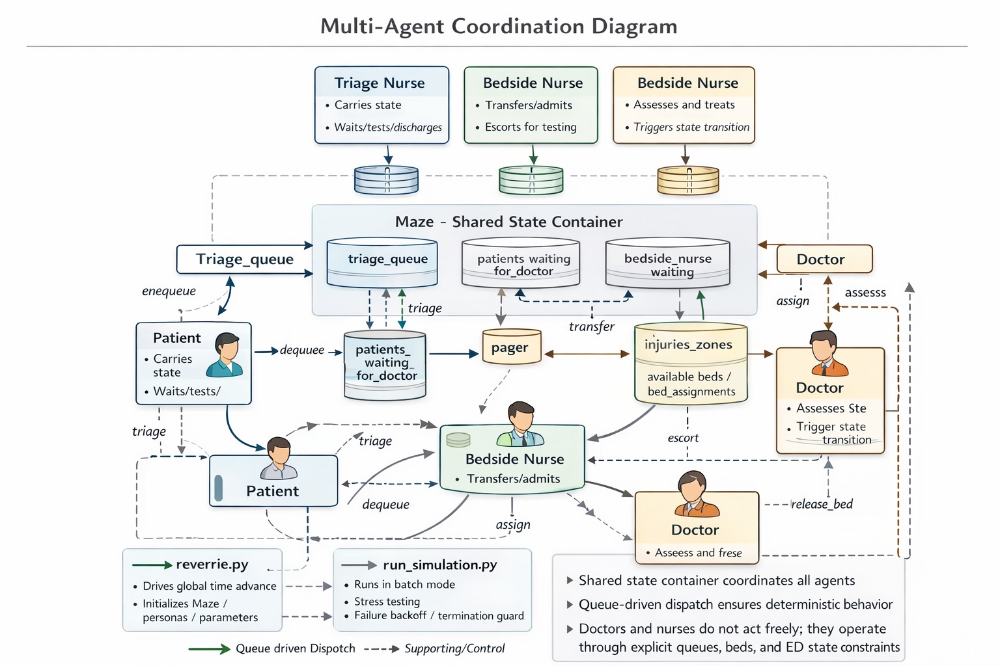
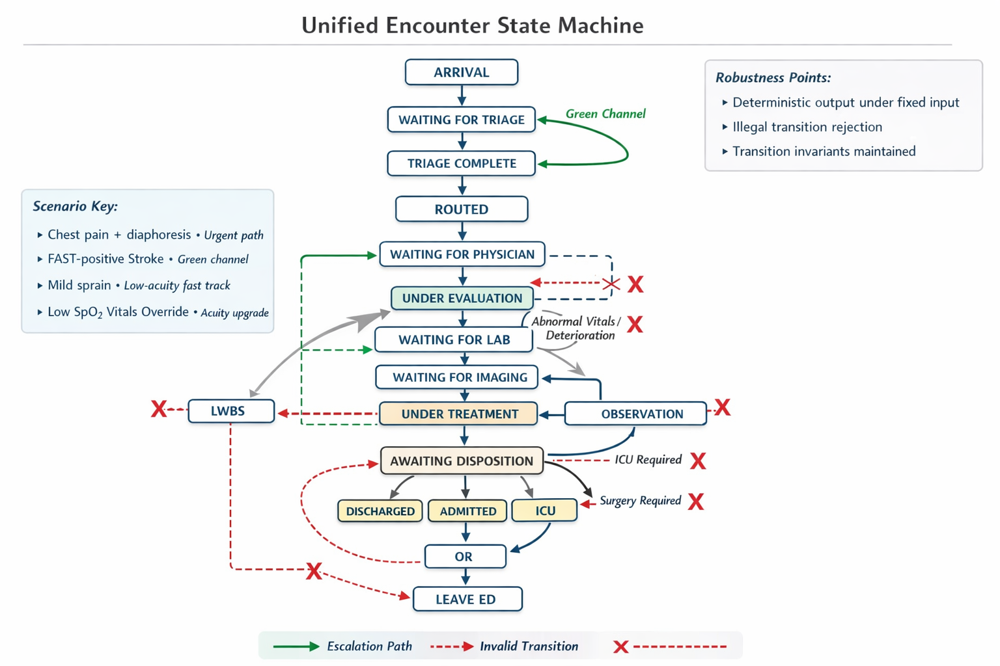
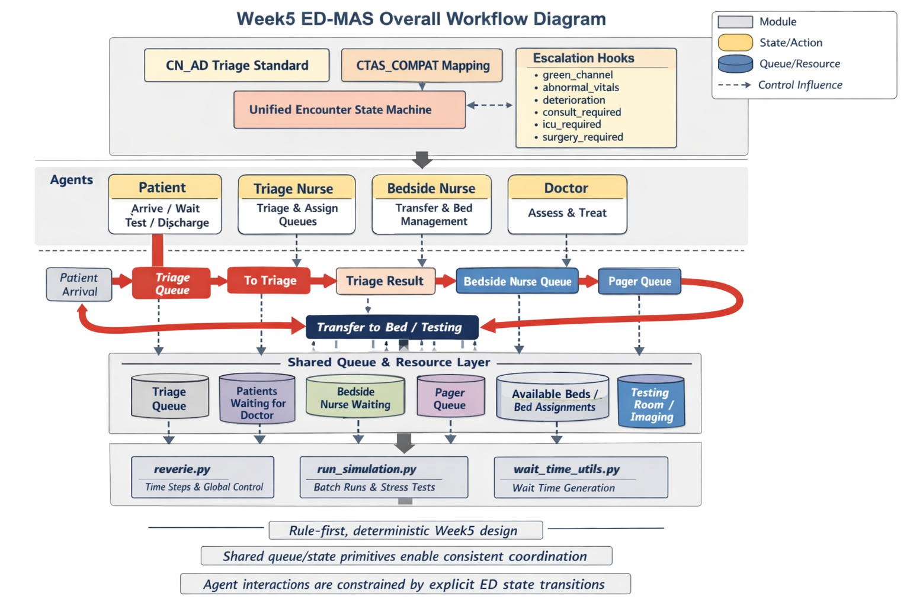

# Week 5 Oncourse 计划（Rule Core + Unified State Machine）

## 目标
在 Mode-U（交互式）与 Mode-A（自动仿真）两种运行方式下，提供确定性的 A-D 分诊、路由与升级机制，并在统一就诊状态机中落地可追踪的 ED 阶段。

## 小任务拆分（Task Mode）
1. 任务：落地 A-D 分诊标准与 CTAS 兼容映射规则。  
涉及文件：`reverie/backend_server/ed/triage_rules.py`、`reverie/backend_server/ed/__init__.py`。  
产出：`CN_AD` 与 `CTAS_COMPAT` 的规则表、规则选择入口与单元接口（不依赖 LLM）。  
验证：新增 `tests/backend/test_ed_triage_rules.py` 覆盖 A-D → CTAS 映射与边界值。

2. 任务：实现分诊路由与升级触发点的统一钩子。  
涉及文件：`reverie/backend_server/ed/escalation.py`、`reverie/backend_server/reverie.py`。  
产出：`green_channel`、`abnormal_vitals`、`deterioration`、`consult_required`、`icu_required`、`surgery_required` 触发判定函数，并在主循环中调用。  
验证：新增 `tests/backend/test_ed_escalation.py`，输入固定 vitals/症状时输出完全一致。

3. 任务：构建统一就诊状态机并接入现有 Persona 流程。  
涉及文件：`reverie/backend_server/ed/state_machine.py`、`reverie/backend_server/persona/persona_types/patient.py`、`reverie/backend_server/reverie.py`。  
产出：明确状态集合（Arrival → Triage → Routed → Evaluation → Treatment → Disposition）与转移约束，患者状态在每步更新并可记录。  
验证：新增 `tests/backend/test_ed_state_machine.py`，覆盖非法转移与不变量。

4. 任务：保证 Mode-U 与 Mode-A 均走同一分诊/路由逻辑。  
涉及文件：`environment/frontend_server/translator/views.py`、`reverie/backend_server/run_simulation.py`。  
产出：交互式入口（Mode-U）与批处理入口（Mode-A）调用同一 triage + routing API。  
验证：新增 `tests/backend/test_ed_user_encounter.py`（模拟 Mode-U 输入）与 `tests/backend/test_ed_auto_mode.py`（模拟 Mode-A 批处理）。

5. 任务：为确定性与鲁棒性提供数据证据输出。  
涉及文件：`reverie/backend_server/reverie.py`、`analysis/compute_metrics.py`。  
产出：输出包含分诊等级、路由结果、升级触发的指标字段，并确保在固定输入下稳定一致。  
验证：扩展 `tests/analysis/test_compute_metrics.py` 对新增字段的输出一致性进行断言。

## 测试计划（临床场景）
1. 胸痛 + 出汗：应触发紧急路径并进入高优先级区域。  
对应测试文件：`tests/backend/test_ed_triage_rules.py`、`tests/backend/test_ed_escalation.py`。

2. FAST 阳性卒中表现：应触发升级路径（绿色通道）。  
对应测试文件：`tests/backend/test_ed_escalation.py`。

3. 轻度扭伤：应进入低急性快速通道。  
对应测试文件：`tests/backend/test_ed_triage_rules.py`、`tests/backend/test_ed_state_machine.py`。

4. 生命体征覆盖：低 SpO2 应提升分诊等级。  
对应测试文件：`tests/backend/test_ed_triage_rules.py`、`tests/backend/test_ed_escalation.py`。

## 鲁棒性证据
1. 固定输入下输出完全一致（deterministic）。  
落点文件：`reverie/backend_server/ed/triage_rules.py`、`reverie/backend_server/ed/escalation.py`。

2. 状态机不变量与非法转移拒绝。  
落点文件：`reverie/backend_server/ed/state_machine.py`、`tests/backend/test_ed_state_machine.py`。

## 里程碑（可验证）
1. 单元 + 集成测试通过（triage / state / user encounter）。  
涉及文件：`tests/backend/test_ed_triage_rules.py`、`tests/backend/test_ed_state_machine.py`、`tests/backend/test_ed_user_encounter.py`。

2. 3 个中文 ED 场景 demo 有可追踪输出。  
涉及文件：`examples/ed_week5_cases.md`、`analysis/compute_metrics.py`。

## week5细化内容

**第一部分：新增文件与整体框架**
新增文件路径（全部来自 `week5_oncourse.md`）：
1. `reverie/backend_server/ed/triage_rules.py`
2. `reverie/backend_server/ed/__init__.py`
3. `tests/backend/test_ed_triage_rules.py`
4. `reverie/backend_server/ed/escalation.py`
5. `tests/backend/test_ed_escalation.py`
6. `reverie/backend_server/ed/state_machine.py`
7. `tests/backend/test_ed_state_machine.py`
8. `tests/backend/test_ed_user_encounter.py`
9. `tests/backend/test_ed_auto_mode.py`
10. `examples/ed_week5_cases.md`

整体框架分层：
1. ED 规则核心层：`reverie/backend_server/ed/`（triage_rules、escalation、state_machine + `__init__.py`）
2. 测试层：`tests/backend/`（triage_rules、escalation、state_machine、user/auto mode）
3. 示例文档层：`examples/ed_week5_cases.md`

**第二部分：逐文件功能与交互**
1. `reverie/backend_server/ed/triage_rules.py`  
主要功能：实现 `CN_AD` 与 `CTAS_COMPAT` 分诊规则表与规则选择入口，提供确定性分诊接口。  
交互文件：`reverie/backend_server/ed/__init__.py`、`tests/backend/test_ed_triage_rules.py`。  
数据流/调用链：外部调用 triage 接口 → 根据规则表输出分诊等级与映射结果。

2. `reverie/backend_server/ed/__init__.py`  
主要功能：统一暴露 ED 模块的公共接口（分诊、升级、状态机）。  
交互文件：`reverie/backend_server/ed/triage_rules.py`、`reverie/backend_server/ed/escalation.py`、`reverie/backend_server/ed/state_machine.py`。  
数据流/调用链：聚合 ED 子模块为统一导入入口。

3. `tests/backend/test_ed_triage_rules.py`  
主要功能：验证 A‑D → CTAS 映射、边界值与分诊输出确定性。  
交互文件：`reverie/backend_server/ed/triage_rules.py`。  
数据流/调用链：测试输入 → triage_rules → 断言输出。

4. `reverie/backend_server/ed/escalation.py`  
主要功能：实现升级触发判定函数：`green_channel`、`abnormal_vitals`、`deterioration`、`consult_required`、`icu_required`、`surgery_required`。  
交互文件：`reverie/backend_server/ed/__init__.py`、`tests/backend/test_ed_escalation.py`。  
数据流/调用链：输入固定症状/体征 → 升级判定 → 输出触发标志。

5. `tests/backend/test_ed_escalation.py`  
主要功能：验证升级触发逻辑的确定性与场景覆盖。  
交互文件：`reverie/backend_server/ed/escalation.py`。  
数据流/调用链：测试输入 → escalation 判定 → 断言触发结果。

6. `reverie/backend_server/ed/state_machine.py`  
主要功能：实现统一就诊状态机（Arrival → Triage → Routed → Evaluation → Treatment → Disposition）及转移约束。  
交互文件：`reverie/backend_server/ed/__init__.py`、`tests/backend/test_ed_state_machine.py`。  
数据流/调用链：状态输入 → 状态机转移 → 输出新状态或拒绝非法转移。

7. `tests/backend/test_ed_state_machine.py`  
主要功能：验证非法转移拒绝与不变量约束。  
交互文件：`reverie/backend_server/ed/state_machine.py`。  
数据流/调用链：测试状态序列 → 状态机 → 断言非法转移被拒。

8. `tests/backend/test_ed_user_encounter.py`  
主要功能：验证 Mode‑U 入口能调用统一 triage + routing 逻辑。  
交互文件：`reverie/backend_server/ed/triage_rules.py`、`reverie/backend_server/ed/escalation.py`、`reverie/backend_server/ed/state_machine.py`。  
数据流/调用链：模拟用户输入 → 统一分诊/升级/状态机 → 验证输出一致。

9. `tests/backend/test_ed_auto_mode.py`  
主要功能：验证 Mode‑A 入口能调用同一 triage + routing 逻辑并保持确定性。  
交互文件：`reverie/backend_server/ed/triage_rules.py`、`reverie/backend_server/ed/escalation.py`、`reverie/backend_server/ed/state_machine.py`。  
数据流/调用链：模拟自动模式输入 → 统一分诊/升级/状态机 → 验证输出一致。

10. `examples/ed_week5_cases.md`  
主要功能：记录 3 个中文 ED 场景 demo 与可追踪输出样例。  
交互文件：作为测试/验证参考文档使用，不参与代码调用。

**第三部分：仅基于 week5_oncourse.md 的代码层面评估**
1. 任务是否可落地：可落地。  
理由：每个任务都有明确的新增文件路径与测试落点，且功能边界清晰。

2. 模块划分是否清晰：清晰。  
理由：核心逻辑集中于 `reverie/backend_server/ed/`，测试集中于 `tests/backend/`，示例文档独立在 `examples/`。

3. 测试是否覆盖目标：覆盖充分，但存在边界依赖。  
理由：triage、escalation、state_machine、user/auto mode 都有对应测试文件，覆盖确定性、非法转移与场景；但 demo 文档与自动验证的衔接未说明。

风险/模糊点（仅限文档内）：
1. `examples/ed_week5_cases.md` 仅作为 demo 文档存在，文档如何与测试或自动验证衔接未说明。  
2. Mode‑U / Mode‑A 具体入口与现有流程的调用方式在文档中未细化，实际对接实现细节需在落地时再补齐。

## week5工程细节补充（agents + simulation_loop + queue_state_primitives）

**图示（Rule Core 相关）**
1. 多智能体协同关系图  

2. 统一就诊状态机图  

3. Week5 整体流程图  

**（1）不同 agent 的作用与交互**
1. Patient（`week5/edmas/week5_edmas/week5_system/agents/patient.py`）
作用：承载患者状态与就诊流程执行，自动推进候诊、检查、结果等待与离院等阶段。
关键变量：`CTAS`（分诊等级）、`injuries_zone`（分区）、`state`（当前状态）、`testing_time`/`testing_result_time`（检查/结果耗时）、`walkout_probability`（离院概率）、`bed_assignment`（床位占用）。
交互：进入 `maze.triage_queue` 由 Triage Nurse 拉取；进入 `patients_waiting_for_doctor` 与 `bedside_nurse_waiting`；由 Bedside Nurse 转运；由 Doctor 触发确定性状态转移。

2. Triage Nurse（`week5/edmas/week5_edmas/week5_system/agents/triage_nurse.py`）
作用：处理分诊队列，完成分诊后将患者加入医生队列与护士队列。
关键变量：`maze.triage_queue`（分诊等待队列）、`maze.triage_patients`（分诊区在位数量）、`maze.triage_capacity`（分诊容量）、`priority_factor`（CTAS 权重系数）。
交互：从 `triage_queue` 拉患者 → 触发患者 `to_triage()` → 分诊完成后将患者放入 `patients_waiting_for_doctor` 与 `bedside_nurse_waiting` 或 `pager` 队列。

3. Bedside Nurse（`week5/edmas/week5_edmas/week5_system/agents/bedside_nurse.py`）
作用：将患者从等待区转运到床位或检查室，并管理检查过程中的陪护与回程。
关键变量：`occupied`（当前任务状态，例如 `Transfer|patient`/`Testing|patient`/`Resting`）、`maze.injuries_zones`（分区容量与队列）、`available_beds`（床位可用表）、`testing_time`（检查耗时）。
交互：从 `bedside_nurse_waiting` 或 `pager` 拉患者 → 预占床位/转运 → 更新患者状态（如 `WAITING_FOR_FIRST_ASSESSMENT`）→ 触发检查流程。

4. Doctor（`week5/edmas/week5_edmas/week5_system/agents/doctor.py`）
作用：按优先级接诊并触发初评与处置的确定性状态转移。
关键变量：`max_patients`（同时可管理患者上限）、`assigned_patients_waitlist`（待诊队列）、`queue_aging_interval_minutes`（队列老化间隔）、`priority_factor`（CTAS 权重）。
交互：从 `maze.patients_waiting_for_doctor` 选择患者 → 触发 `do_initial_assessment()` 与 `do_disposition()` → 更新患者状态与队列。

**交互主链路（简述）**
1. Patient 进入 `triage_queue`。
2. Triage Nurse 拉取患者 → 完成分诊 → 放入医生队列与护士队列。
3. Bedside Nurse 转运患者到床位或检查室。
4. Doctor 按优先级接诊并推进状态机。
5. Patient 在检查与结果等待中自主管理，最终离院或转入住院流程。

**（2）Week5 代码文件（分工/命名：工程细节 + 变量说明 + 作用）**
1. `week5/edmas/week5_edmas/week5_system/agents/patient.py`
工程细节：`move()` 负责状态推进、离院、检查、结果等待与床位释放；`do_initial_assessment()` 与 `do_disposition()` 是确定性状态转移入口。
变量说明：`walkout_states`（允许离院状态集合）、`testing_probability_by_ctas`（按 CTAS 决定是否检查）、`admission_boarding_minutes_min/max`（住院留床时长区间）。
作用：把患者从“规则层状态”变成“可执行实体”，保证流程可运行与可统计。

2. `week5/edmas/week5_edmas/week5_system/agents/triage_nurse.py`
工程细节：从 `triage_queue` 取患者进入分诊；结束后按 CTAS 优先级分配医生/护士队列。
变量说明：`maze.triage_patients`（分诊区人数）、`priority_factor`（CTAS 排序权重）、`pager`（CTAS1 紧急队列）。
作用：完成“分诊入口 → 候诊队列”的关键转换。

3. `week5/edmas/week5_edmas/week5_system/agents/bedside_nurse.py`
工程细节：处理转运、床位预占与检查陪护；记录详细日志（状态时长、动作日志、交互日志）。
变量说明：`occupied_since`（占用开始时间）、`State_Durations`/`Action_Log`/`Interactions`（行为日志）。
作用：把“候诊 → 床位/检查”的流程落到可执行转运层。

4. `week5/edmas/week5_edmas/week5_system/agents/doctor.py`
工程细节：队列老化机制防止低优先级患者长期等待；接诊时立即触发患者确定性状态转移。
变量说明：`queue_aging_interval_minutes`/`queue_aging_decrement`（队列公平性参数）、`TERMINAL_STATES`（不再占用医生名额的状态）。
作用：将规则层优先级转化为实际接诊顺序。

5. `week5/edmas/week5_edmas/week5_system/simulation_loop/reverie.py`
工程细节：读取 meta.json 初始化仿真参数；构建 `Maze`、加载 personas；按时间步驱动全局循环。
变量说明：`sec_per_step`（每步秒数）、`patient_rate`（到达率）、`surge_multiplier`（高峰拥挤系数）、`triage_starting_amount`/`doctor_starting_amount`/`bedside_starting_amount`（初始角色数）。
作用：提供全局时间推进与资源约束，是 Week5 规则运行的基础环境。

6. `week5/edmas/week5_edmas/week5_system/simulation_loop/run_simulation.py`
工程细节：安全模式批量运行脚本，按 `hours_to_run` 与 `steps_per_save` 分段执行，并带失败退避与熔断。
变量说明：`write_movement`（是否生成回放文件）、`_BACKOFF_DELAYS`（失败退避间隔）。
作用：用于压力测试与批量仿真，不依赖前端交互。

7. `week5/edmas/week5_edmas/week5_system/queue_state_primitives/maze.py`
工程细节：解析 Tiled 地图与 block 配置，构建网格、事件、床位与队列系统；维护 `triage_queue`、`patients_waiting_for_doctor` 与 `injuries_zones`。
变量说明：`address_tiles`（位置反向索引）、`triage_capacity`（分诊容量）、`bed_assignments`/`available_beds`（床位分配与空闲表）。
作用：统一维护空间 + 队列 + 床位资源，是所有 agent 共享的状态容器。

8. `week5/edmas/week5_edmas/week5_system/queue_state_primitives/wait_time_utils.py`
工程细节：按 CTAS 与阶段抽样等待时间，支持截断对数正态与 hurdle-lognormal 分布；生成分阶段等待目标。
变量说明：`stage1_minutes`/`stage2_minutes`/`stage3_minutes`（分阶段等待时长）、`stage1_surge_extra`/`stage2_surge_extra`（拥挤额外延时）。
作用：提供可控等待时间机制，让仿真更接近真实 ED 时序。
