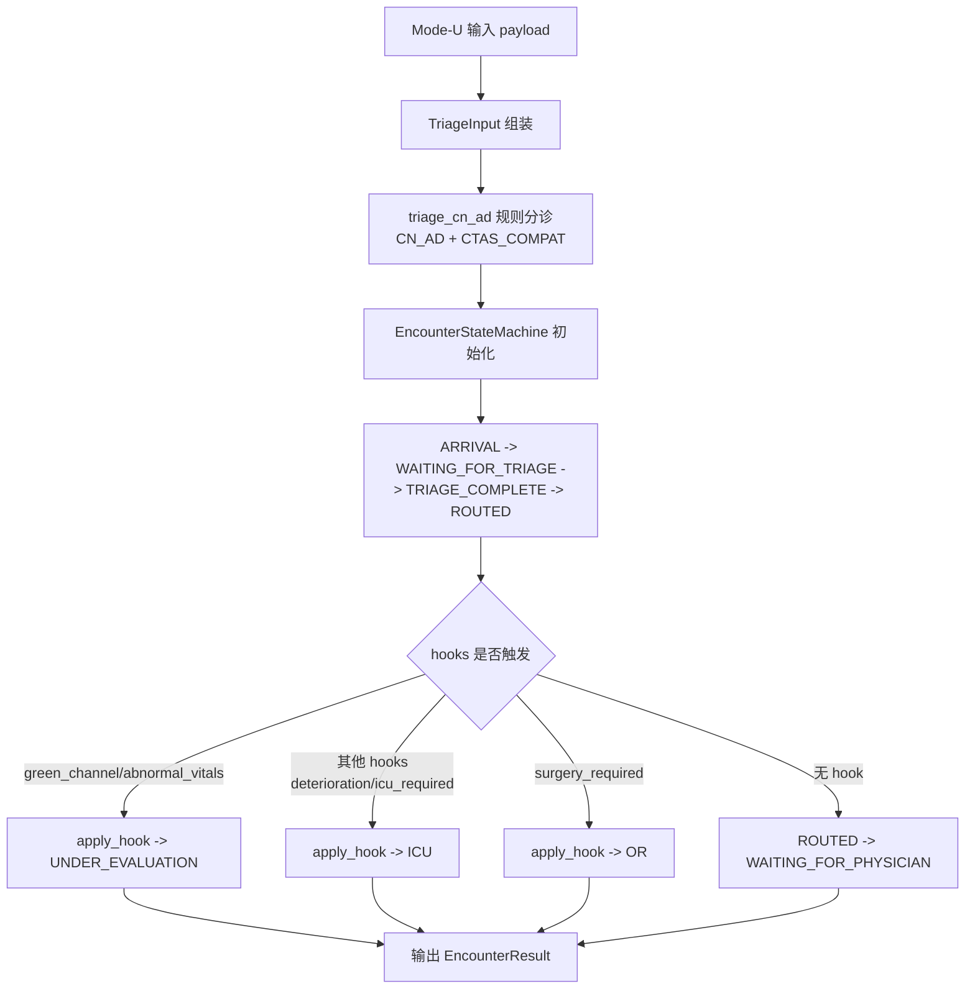
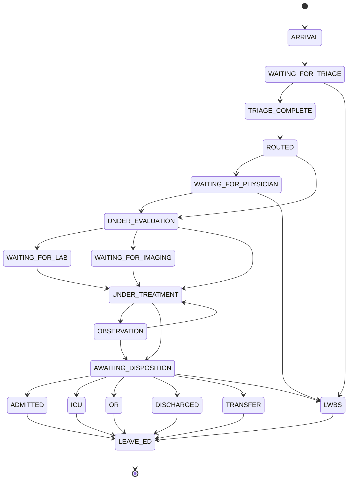

# Week 5 周报讲稿（EDMAS）

## 1. 本周目标与完成结果
本周我完成了 ED-MAS 的第一阶段可运行内核，核心目标是把急诊流程中最关键的三件事落地：
1. 分诊规则可解释、可复现。
2. 患者状态流转有统一状态机约束。
3. User 模式可从输入病例直接跑到结构化输出，并通过自动化测试验证。

本周代码集中在：`edmas/week5_edmas/week5_system`，形成了完整的 Week 5 单体贡献目录。

---

## 2. 本周代码板块说明（按目录）

### 2.1 `week5_system/agents`
这一层定义了急诊流程里的核心角色实现：Patient、Triage Nurse、Bedside Nurse、Doctor。其作用是承载角色行为、任务状态与角色间协作入口，为后续多智能体协同提供执行实体。

### 2.2 `week5_system/simulation_loop`
这一层提供仿真循环骨架（主循环与批量运行入口），作用是推进时间步、触发角色动作、同步流程状态，是后续 Auto 模式和压力场景运行的基础。

### 2.3 `week5_system/queue_state_primitives`
这一层封装急诊队列/状态基础结构（空间、队列、等待时间工具），用于表达“谁在排队、排在哪、何时升级”。本周重点是把它作为规则层和 agent 层之间的状态承载底座。

### 2.4 `week5_system/rule_core`
这是本周新增的规则核心层，包含三个模块：
- `triage_policy.py`：`CN_AD + CTAS_COMPAT` 分诊映射与触发规则。
- `state_machine.py`：统一患者状态机 + 非法迁移拦截 + 升级钩子处理。
- `encounter.py`：将分诊与状态机编排成一次完整用户 encounter。

### 2.5 `week5_system/app`
`mode_user.py` 是本周可运行入口：接收输入 payload，组装 `TriageInput`，调用 `start_user_encounter`，返回结构化输出：`patient_id / triage / final_state / state_trace`。

---

## 3. 板块之间如何交互
本周交互链路是“输入驱动 + 规则主导”的闭环：

1. 用户输入到 `mode_user.start(payload)`。
2. `mode_user` 将输入标准化为 `TriageInput`。
3. `encounter.start_user_encounter` 调用 `triage_cn_ad` 计算分级结果与 hooks。
4. `EncounterStateMachine` 按固定流程推进：
   `ARRIVAL -> WAITING_FOR_TRIAGE -> TRIAGE_COMPLETE -> ROUTED`。
5. 如果触发 hook（如 `green_channel` 或 `abnormal_vitals`），状态机会执行升级迁移（例如强制进入 `UNDER_EVALUATION`）。
6. 输出最终状态与完整状态轨迹 `state_trace`，用于回放与验证。

同时，`agents + simulation_loop + queue_state_primitives` 作为系统运行底座，保障后续从规则闭环过渡到完整多智能体联动时不需要推翻结构。

---

### 3.1 Week5 流程图/状态机图




## 4. 本周核心规则（讲清楚规则是什么）

### 4.1 分诊规则（`CN_AD + CTAS_COMPAT`）
- A 对应 CTAS 1，B 对应 CTAS 2，C 对应 CTAS 3，D 对应 CTAS 4。
- 区域映射：A->red，B/C->yellow，D->green。

### 4.2 症状与升级触发
- 胸痛 + 冷汗（或同义关键词）=> `green_channel`，直接高危分层（A）。
- FAST 阳性卒中线索 => `green_channel`，高危分层（A）。
- `SpO2 < 90` 或 `SBP < 90` => `abnormal_vitals`，至少升级到 B。
- 轻度扭伤 => 低危路径 D。

### 4.3 状态机约束
- 所有状态迁移必须命中 `ALLOWED_TRANSITIONS`，否则抛出异常。
- 升级钩子受 `HOOK_ESCALATIONS` 管理，不能任意跨跳。
- 通过这一机制保证流程“可追踪、可校验、可拒绝非法路径”。

---

## 5. Week 5 测试设计与执行流程
本周测试文件：`tests/test_week5_scope.py`，共 6 个用例，全部通过。

### 5.1 测试命令
```bash
cd /home/jiawei2022/BME1325/week5_progress/EDMAS/edmas/week5_edmas
python -m pytest -q
```

### 5.2 用例与验证目标
1. **胸痛+冷汗**：验证高危识别与绿色通道触发。  
2. **FAST 阳性卒中**：验证卒中升级路径进入紧急评估状态。  
3. **轻度扭伤**：验证低危分流（D）与普通等待路径。  
4. **低 SpO2 覆盖升级**：验证生命体征可覆盖症状优先级。  
5. **非法状态迁移拒绝**：验证状态机防错能力。  
6. **Deterministic Replay**：同输入重复执行输出一致。

### 5.3 用例流程（以多角色协作为主线）
以“胸痛+冷汗”用例为例：
- 患者信息进入 User 模式。
- 分诊规则将患者判定为 A 并触发 `green_channel`。
- 状态机从分诊完成后直接升级到 `UNDER_EVALUATION`。
- 从业务语义上对应 Triage Nurse 快速分流、Doctor 优先接诊、Nurse 配合准备的协作路径。

以“轻度扭伤”用例为例：
- 患者被判定 D 级。
- 状态停留在 `WAITING_FOR_PHYSICIAN`，不触发紧急升级。
- 对应资源公平分配场景，保障急危重优先。

---

## 6. 下周（Week 6）计划
依据 `EDMAS_week5_12_workflow.md`，下周目标是 **User Mode 闭环 + L1 接口冻结**。

### 6.1 下周交付目标
1. 完成用户到急诊 encounter 的接口化启动：`/mode/user/encounter/start`。  
2. 完成并冻结三类 L1 接口：  
   - `POST /ed/handoff/request`  
   - `POST /ed/handoff/complete`  
   - `GET /ed/queue/snapshot`  
3. 增加 payload schema 校验与异常输入容错。

### 6.2 下周测试计划
1. 合约测试：字段完整性、类型、状态码。  
2. 脏输入测试：缺字段、空字段、噪声文本。  
3. 联调测试：ICU/Ward mock handoff request/complete 闭环。  
4. 回归测试：Week 5 六个规则用例必须继续全通过。

### 6.3 周目标验收标准
- 用户输入可通过接口触发完整 encounter。  
- handoff 与 queue snapshot 接口在约定 schema 下稳定返回。  
- 规则核心不回退，状态机约束持续生效。  
- 输出日志与状态轨迹可用于复盘与答辩演示。

---

## 7. 汇报收束
本周我完成了 ED-MAS 的“规则可控内核”：
- 分诊规则明确。
- 状态机有边界。
- 输入到输出形成可测试闭环。

下周将进入“接口冻结与联调”阶段，把当前规则能力升级为可对外协同的子系统能力，为后续 Auto 模式、记忆增强和安全治理打下稳定基础。
